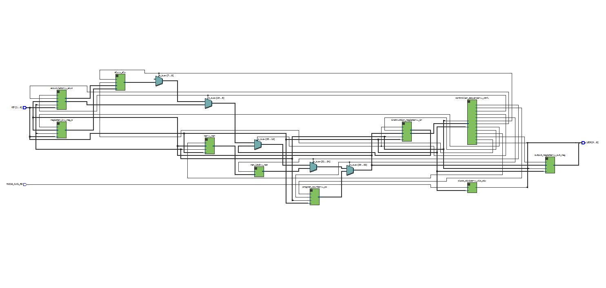
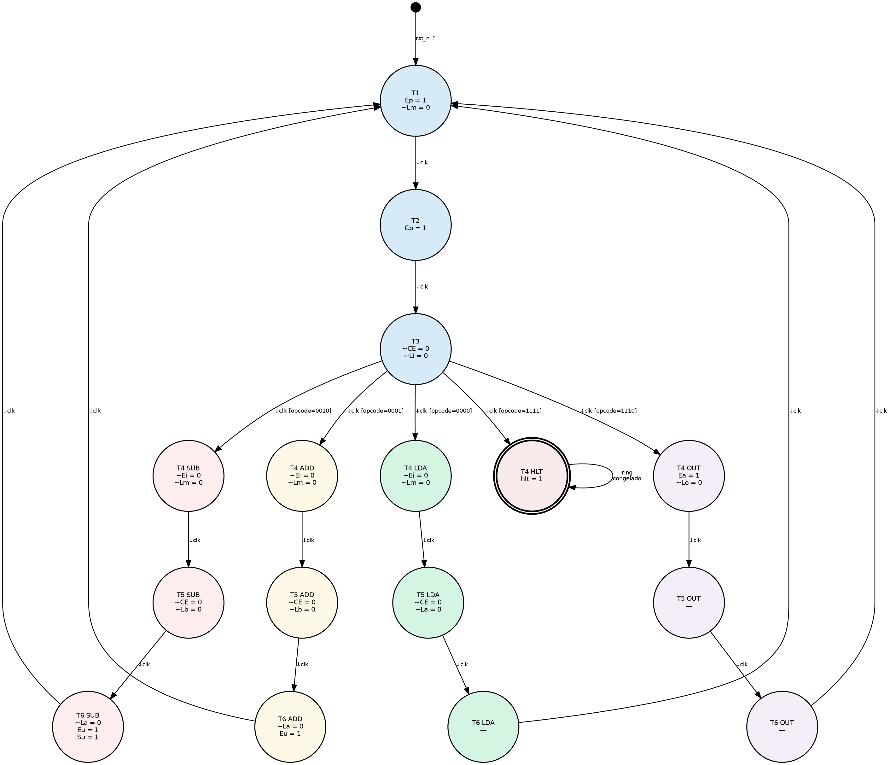
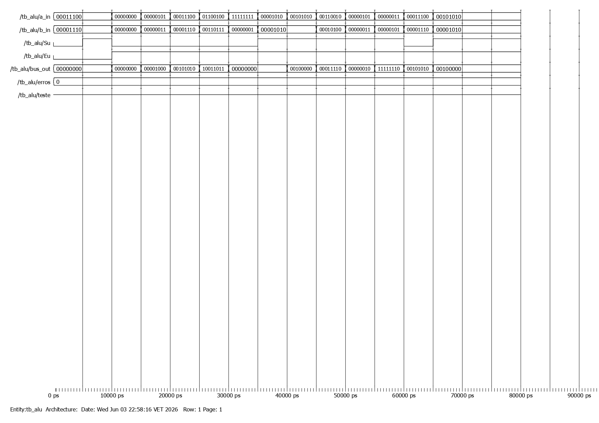
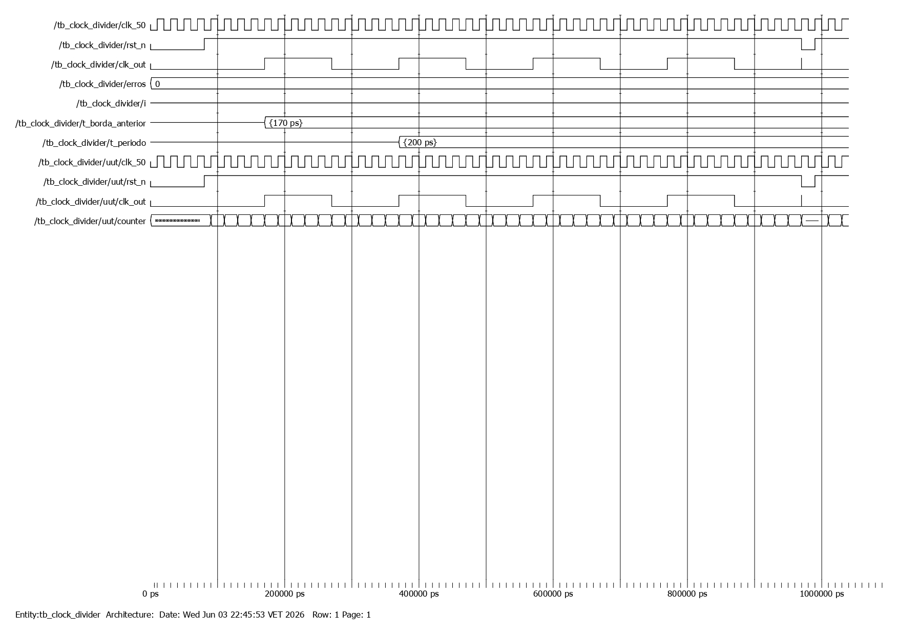
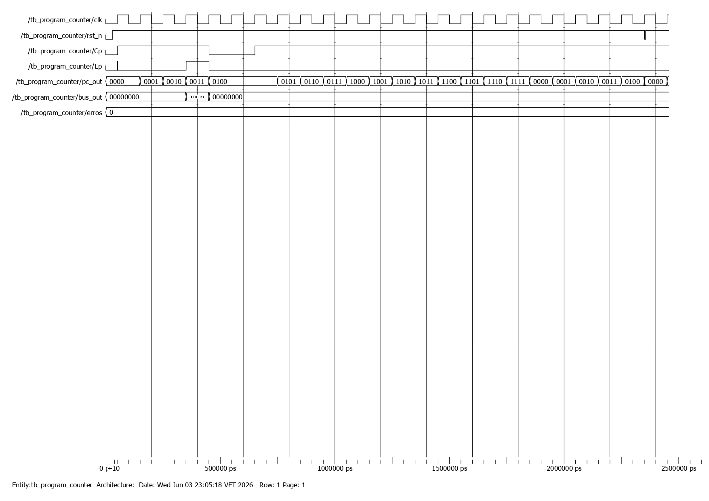
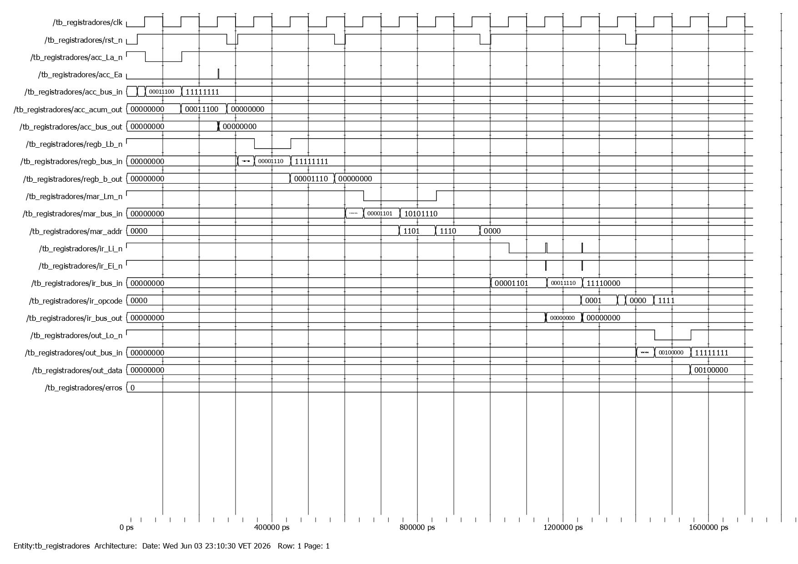
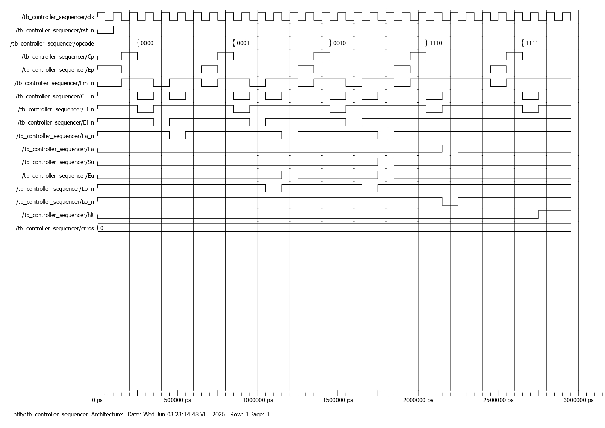
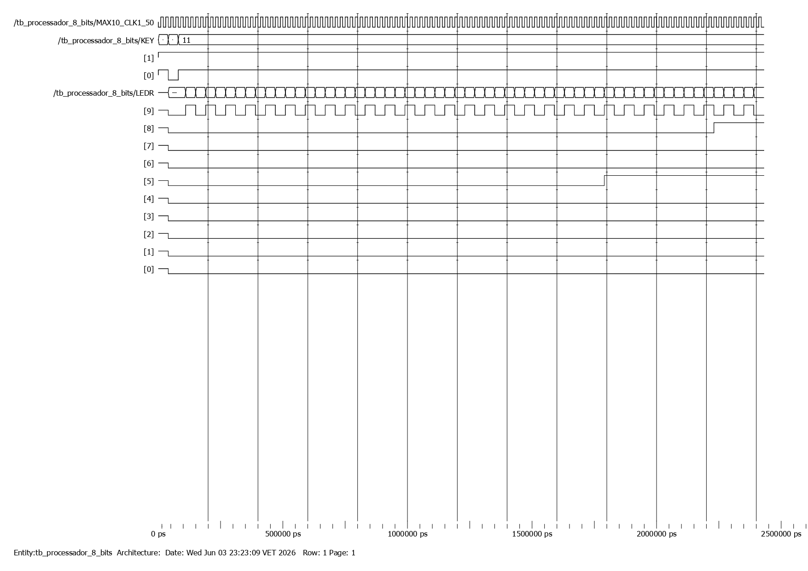
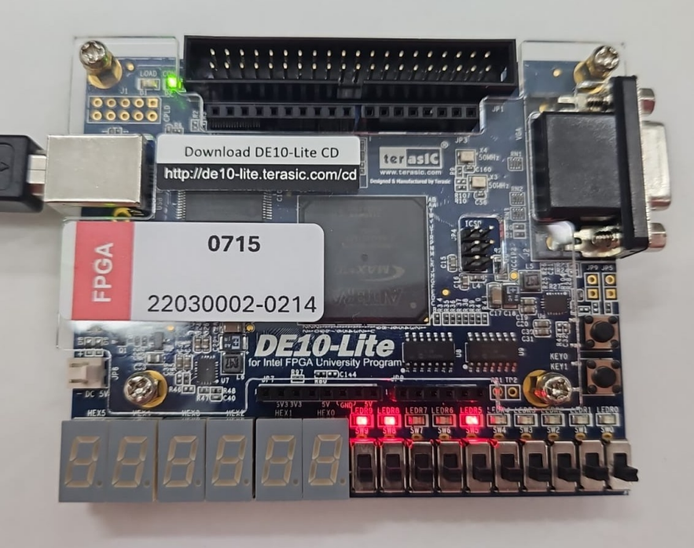

# Processador de 8 Bits (SAP-1) em Verilog

Implementação completa do processador educacional **SAP-1** (*Simple As Possible 1*), proposto por Malvino e Brown, desenvolvida em **Verilog HDL** e sintetizada na FPGA **Terasic DE10-Lite** (Intel/Altera MAX 10).

Projeto desenvolvido como relatório técnico para a disciplina de **Eletrônica Digital II e Laboratório de Eletrônica Digital**, ministrada pelo Prof. Dr. Thiago Brito — Faculdade de Engenharia Elétrica e de Computação (FEEC), Universidade Federal do Amazonas (UFAM).

---

## Índice

- [Sobre o projeto](#sobre-o-projeto)
- [Arquitetura](#arquitetura)
- [Conjunto de instruções](#conjunto-de-instruções)
- [Palavra de controle](#palavra-de-controle)
- [Máquina de Estados Finitos (FSM)](#máquina-de-estados-finitos-fsm)
- [Estrutura do repositório](#estrutura-do-repositório)
- [Programa de teste](#programa-de-teste)
- [Simulação e testbenches](#simulação-e-testbenches)
- [Resultado na FPGA](#resultado-na-fpga)
- [Como executar](#como-executar)
- [Extensão futura: controle via PC hospedeiro](#extensão-futura-controle-via-pc-hospedeiro)
- [Referências](#referências)
- [Vídeo de apresentação](#vídeo-de-apresentação)
- [Autores](#autores)

---

## Sobre o projeto

O **SAP-1** é um processador didático de 8 bits, com um conjunto de instruções reduzido (apenas cinco operações) e um barramento único de 8 bits — o **Barramento W** — por onde trafegam endereços e dados entre todos os módulos do sistema.

Apesar da simplicidade, o SAP-1 contempla todos os elementos essenciais de uma CPU real:

- busca e decodificação de instruções (*fetch/decode*);
- ciclo de execução controlado por uma unidade de controle (FSM);
- operações aritméticas via ULA (somador/subtrator);
- mecanismos de entrada e saída de dados.

**Principais objetivos alcançados:**

- Descrição em nível RTL de todos os módulos da arquitetura (PC, MAR, RAM, IR, Acumulador, Registrador B, ALU, Registrador de Saída, Controlador/Sequenciador e Divisor de Clock);
- Unidade de controle implementada como FSM com seis estados de temporização (T1–T6), via *ring counter* acionado na borda negativa do clock;
- Geração correta da palavra de controle de 12 bits para cada instrução;
- Solução do conflito de barramento causado pela ausência de lógica *tristate* interna na FPGA MAX 10, usando um multiplexador prioritário;
- Testbenches com verificação automatizada (contagem de erros) para todos os módulos e para o processador completo;
- Demonstração funcional na placa DE10-Lite, com clock reduzido a ~1 Hz para observação visual da execução.

---

## Arquitetura

Todos os módulos se comunicam por um único barramento de 8 bits (**Barramento W**). Como a família Intel MAX 10 não suporta *tristate* interno, o barramento é implementado como um **multiplexador prioritário** no módulo top-level, com a seguinte ordem de prioridade: **PC → RAM → IR → Acumulador → ALU**.

```
assign w_bus = Ep       ? pc_bus_out   :
               (!CE_n)  ? ram_bus_out  :
               (!Ei_n)  ? ir_bus_out   :
               Ea       ? acum_bus_out :
               Eu       ? alu_bus_out  :
               8'h00;
```

A palavra de controle gerada pelo controlador/sequenciador garante que, a cada estado de temporização, no máximo um desses sinais esteja ativo, eliminando qualquer conflito no barramento.



> Circuito do top-level extraído do Quartus Prime, mostrando os módulos instanciados e o barramento W interligando-os.

### Módulos do processador

| Módulo | Arquivo | Função |
|---|---|---|
| Top-level | `processador_8_bits_top.v` | Instancia e interliga todos os submódulos; mapeia sinais para os pinos da DE10-Lite |
| Divisor de Clock | `clock_divider.v` | Reduz o clock de 50 MHz para ~1 Hz (observação visual) |
| Contador de Programa | `program_counter.v` | PC de 4 bits, aponta a próxima instrução na RAM |
| Registrador de Endereço | `mar.v` | MAR — armazena o endereço usado para acessar a RAM |
| Memória RAM 16×8 | `ram_16x8.v` | Armazena programa e dados (pré-carregados) |
| Registrador de Instrução | `instruction_register.v` | IR — separa opcode (nibble alto) e operando (nibble baixo) |
| Acumulador A | `accumulator.v` | Registrador central de resultados |
| Registrador B | `register_b.v` | Segundo operando das operações aritméticas |
| ALU | `alu.v` | Somador/subtrator assíncrono de 8 bits |
| Registrador de Saída | `output_register.v` | Guarda o valor final exibido nos LEDs |
| Controlador/Sequenciador | `controller_sequencer.v` | FSM — gera a palavra de controle de 12 bits |

---

## Conjunto de instruções

Cada instrução tem 8 bits: 4 bits de **opcode** (nibble alto) + 4 bits de **operando/endereço** (nibble baixo).

```
 7 6 5 4 | 3 2 1 0
 Opcode  | Endereço
```

| Mnemônico | Opcode (bin) | Hex | Operação |
|---|---|---|---|
| `LDA` | `0000` | `0` | Acumulador ← RAM[endereço] |
| `ADD` | `0001` | `1` | Acumulador ← Acumulador + RAM[endereço] |
| `SUB` | `0010` | `2` | Acumulador ← Acumulador − RAM[endereço] |
| `OUT` | `1110` | `E` | Registrador de Saída ← Acumulador |
| `HLT` | `1111` | `F` | Interrompe o processamento |

---

## Palavra de controle

A cada estado de temporização, o controlador emite uma palavra de controle de 12 bits:

```
CON = Cp Ep Lm̄ C̄E L̄i Ēi L̄a Ea Su Eu L̄b L̄o
```

| Sinal | Nome | Ação quando ativo | Nível ativo |
|---|---|---|---|
| `Cp` | Counter Program | Incrementa o PC | Alto |
| `Ep` | Enable PC | PC → Barramento W | Alto |
| `Lm` | Load MAR | Barramento W → MAR | Baixo |
| `CE` | Chip Enable RAM | RAM[MAR] → Barramento W | Baixo |
| `Li` | Load IR | Barramento W → IR | Baixo |
| `Ei` | Enable IR | Operando IR → Barramento W | Baixo |
| `La` | Load Acumulador | Barramento W → Acumulador | Baixo |
| `Ea` | Enable Acumulador | Acumulador → Barramento W | Alto |
| `Su` | Subtract | Seleciona subtração na ALU | Alto |
| `Eu` | Enable ALU | ALU → Barramento W | Alto |
| `Lb` | Load Registrador B | Barramento W → Reg. B | Baixo |
| `Lo` | Load Registrador de Saída | Barramento W → Reg. Saída | Baixo |

---

## Máquina de Estados Finitos (FSM)

O controlador implementa um **ring counter** de 6 bits, sensível à **borda negativa do clock**, com um único bit em nível alto por vez — representando os estados **T1 a T6**.

- **T1–T3 (ciclo de busca):** idêntico para todas as instruções — busca e carrega a próxima instrução no IR.
  - **T1** — Estado de Endereço: `PC → MAR` (`Ep=1`, `Lm=0`)
  - **T2** — Estado de Incremento: `PC = PC + 1` (`Cp=1`)
  - **T3** — Estado de Memória: `RAM[MAR] → IR` (`CE=0`, `Li=0`)
- **T4–T6 (ciclo de execução):** dependem do opcode decodificado no IR.

Ao completar T6 (com `hlt = 0`), o *ring counter* retorna automaticamente a T1, iniciando a busca da próxima instrução. Quando a instrução `HLT` é detectada em T4, o sinal `hlt` é ativado e o *ring counter* congela — o processador para sem interromper o clock global.



> Diagrama completo da FSM com todos os estados (T1–T6), transições e ramificação por opcode (LDA, ADD, SUB, OUT, HLT).

---

## Estrutura do repositório

```
processador-8-bits/
├── .gitignore
├── README.md
│
├── processador_8_bits/                        # Código-fonte Verilog + projeto Quartus
│   ├── processador_8_bits_top.v
│   ├── clock_divider.v
│   ├── program_counter.v
│   ├── mar.v
│   ├── ram_16x8.v
│   ├── instruction_register.v
│   ├── accumulator.v
│   ├── register_b.v
│   ├── alu.v
│   ├── output_register.v
│   ├── controller_sequencer.v
│   ├── tb_alu.v
│   ├── tb_clock_divider.v
│   ├── tb_program_counter.v
│   ├── tb_registradores.v
│   ├── tb_controller_sequencer.v
│   ├── tb_processador_8_bits.v
│   ├── processador_8_bits.qpf
│   ├── processador_8_bits_top.qsf
│   └── modelsim/                              # Arquivos .mpf de cada simulação (ModelSim)
│       ├── simulacao_alu/
│       ├── simulacao_clock/
│       ├── simulacao_program_counter/
│       ├── simulacao_registradores/
│       ├── simulacao_controller_sequencer/
│       └── simulacao_global/
│
├── imagens-e-simulacoes/                      # Diagramas, waveforms e resultado na FPGA
│   ├── resultado_fpga.png
│   ├── circuito-top-level/
│   │   └── image.png                          # Circuito completo do top-level (Quartus)
│   ├── diagrama-de-maquinas-de-estados/
│   │   └── diagrama_maquina_de_estados.png
│   └── modelsim/                              # Waveforms exportadas do ModelSim
│       ├── alu_wave.jpg
│       ├── clock_divider_wave.jpg
│       ├── program_counter_wave.jpg
│       ├── register_wave.jpg
│       ├── controller_sequencer_wave.jpg
│       └── global_wave.jpg
│
└── relatorio-do-projeto/
    └── relatorio-processador-de-8-bits-eletronica-digital-II.pdf
```

---

## Programa de teste

Programa pré-carregado na RAM (16×8), armazenado no bloco `initial` de `ram_16x8.v`:

| Endereço | Binário | Instrução | Comentário |
|---|---|---|---|
| `0x0` | `0000_1101` | `LDA 13` | Acumulador ← RAM[13] = 28 |
| `0x1` | `0001_1110` | `ADD 14` | Acumulador ← 28 + 14 = 42 |
| `0x2` | `0010_1111` | `SUB 15` | Acumulador ← 42 − 10 = 32 |
| `0x3` | `1110_0000` | `OUT` | Saída ← 32 |
| `0x4` | `1111_0000` | `HLT` | Para o processamento |
| `0xD` | `0001_1100` | dado: 28 | Primeiro operando |
| `0xE` | `0000_1110` | dado: 14 | Segundo operando |
| `0xF` | `0000_1010` | dado: 10 | Terceiro operando |

**Resultado esperado:** `28 + 14 − 10 = 32` → `0010_0000` em binário de 8 bits.

---

## Simulação e testbenches

Foram desenvolvidos **seis testbenches** no ModelSim — cinco unitários e um de integração global — todos com verificação automatizada por contagem de erros (variável `erros`).

| Testbench | Módulo testado | Erros | Status |
|---|---|:---:|:---:|
| `tb_alu.v` | ALU (somador/subtrator) | 0 | ✅ SUCESSO |
| `tb_clock_divider.v` | Divisor de Clock | 0 | ✅ SUCESSO |
| `tb_program_counter.v` | Contador de Programa | 0 | ✅ SUCESSO |
| `tb_registradores.v` | Acumulador, Reg. B, MAR, IR, Reg. Saída | 0 | ✅ SUCESSO |
| `tb_controller_sequencer.v` | Controlador/Sequenciador (FSM) | 0 | ✅ SUCESSO |
| `tb_processador_8_bits.v` | Processador completo (integração) | 0 | ✅ SUCESSO |

O testbench global instancia o `processador_8_bits_top` com `MAX_COUNT = 2` (clock acelerado para simulação), aplica um pulso de reset e aguarda a ativação de `LEDR[8]` (sinal de `HLT`), verificando ao final se `LEDR[7:0] == 32`.

### Waveforms

<table>
<tr>
<td align="center"><br><sub>ALU — soma e subtração assíncronas</sub></td>
<td align="center"><br><sub>Divisor de Clock — período de saída</sub></td>
</tr>
<tr>
<td align="center"><br><sub>Program Counter — incremento e overflow</sub></td>
<td align="center"><br><sub>Registradores (Acumulador, Reg. B, MAR, IR, Saída)</sub></td>
</tr>
<tr>
<td align="center"><br><sub>Controlador/Sequenciador — sequência T1→T6</sub></td>
<td align="center"><br><sub>Simulação global — processador completo</sub></td>
</tr>
</table>

Os testbenches em Verilog usados nessas simulações estão em [`processador_8_bits/`](processador_8_bits/), junto com o restante do código-fonte.

---

## Resultado na FPGA

O processador foi sintetizado e demonstrado fisicamente na placa **Terasic DE10-Lite**, com o clock reduzido a aproximadamente 1 Hz (via `clock_divider`), permitindo observar visualmente a execução instrução a instrução.



> Placa DE10-Lite ao final da execução: `LEDR5` aceso (bit de peso 32), `LEDR8` aceso (halt) e `LEDR9` piscando (heartbeat).

Ao final da execução do programa de teste:

- **`LEDR[7:0] = 0010_0000`** → **32 em decimal** (`LEDR5` aceso), resultado de `28 + 14 − 10`;
- **`LEDR[8]` aceso** → indica que a instrução `HLT` foi executada e o processador está parado;
- **`LEDR[9]` piscando** → *heartbeat*, indicador visual de que o clock lento está ativo.

### Mapeamento de pinos (DE10-Lite)

| Sinal | Pino | Função |
|---|---|---|
| `MAX10_CLK1_50` | `PIN_P11` | Clock principal (50 MHz) |
| `KEY[0]` | `PIN_B8` | Reset assíncrono (ativo em baixo) |
| `LEDR[7:0]` | `PIN_A8`–`B11` | Resultado do Registrador de Saída (binário) |
| `LEDR[8]` | `PIN_A11` | Indicador de `HLT` |
| `LEDR[9]` | `PIN_B12` | *Heartbeat* (pisca no ritmo do clock lento) |

---

## Como executar

### Simulação (ModelSim)

```bash
# a partir da pasta processador_8_bits/
vlog *.v
vsim -c tb_processador_8_bits -do "run -all; quit"
```

> Os arquivos `.mpf` de cada simulação já configurada ficam em `processador_8_bits/modelsim/simulacao_*/`, um por módulo testado.

Cada testbench individual pode ser rodado da mesma forma, substituindo `tb_processador_8_bits` pelo nome desejado (ex.: `tb_alu`, `tb_controller_sequencer`, etc.).

### Síntese (Quartus Prime)

1. Abra o arquivo `processador_8_bits.qpf` no Quartus Prime.
2. Verifique se o dispositivo alvo está configurado como **10M50DAF484C7G** (MAX 10, DE10-Lite).
3. Rode **Start Compilation**.
4. Programe a FPGA via **Programmer**, usando o arquivo `.sof` gerado em `output_files/`.
5. Observe os LEDs `LEDR[7:0]` (resultado), `LEDR[8]` (HLT) e `LEDR[9]` (heartbeat).

---

## Extensão futura: controle via PC hospedeiro

Como proposta de extensão, o processador poderia ser controlado dinamicamente por um computador hospedeiro, em vez de executar um programa fixo pré-carregado na RAM. Isso exigiria três mudanças principais:

1. **Comunicação serial (UART)** entre a FPGA e o PC, para envio de comandos e dados;
2. **RAM com porta de escrita externa**, permitindo carregar programas dinamicamente (como um bootloader);
3. **Controle externo do *ring counter*** (`start` / `stop` / `step`), permitindo depuração ciclo a ciclo.

Do lado do PC, um script (por exemplo, em Python com `pyserial`) seria responsável por montar o programa em linguagem de máquina, enviá-lo via UART, disparar a execução e ler o resultado de volta.

---

## Referências

1. MALVINO, Albert Paul; BROWN, Jerald A. *Digital Computer Electronics*. 3. ed. Nova York: McGraw-Hill, 1992.
2. TOCCI, Ronald J.; WIDMER, Neal S.; MOSS, Gregory L. *Sistemas Digitais: Princípios e Aplicações*. 11. ed. São Paulo: Pearson Prentice Hall, 2011.
3. PATTERSON, David A.; HENNESSY, John L. *Computer Organization and Design: The Hardware/Software Interface*. 5. ed. Waltham: Morgan Kaufmann, 2014.
4. TERASIC INC. *DE10-Lite User Manual*. Hsinchu: Terasic Technologies, 2016.

O relatório técnico completo está disponível em [`relatorio-do-projeto/relatorio-processador-de-8-bits-eletronica-digital-II.pdf`](relatorio-do-projeto/relatorio-processador-de-8-bits-eletronica-digital-II.pdf).

---

## Vídeo de apresentação

Vídeo com a explicação da arquitetura, estrutura do projeto, código e resultados:

[](https://youtu.be/hFtpx2RRRTw)

---

## Autores

- Larissa Rafaela Ribeiro de Souza
- Samy Yano Mallmann

Projeto desenvolvido para a disciplina de Eletrônica Digital II, ministrada pelo Prof. Dr. Thiago Brito — FEEC/UFAM, Manaus-AM, 2026.